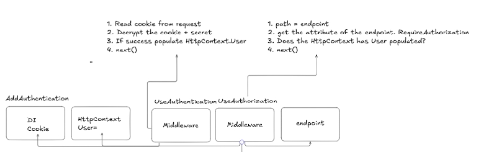

## Identity Process follow belowed steps: 
1. login
2. cookie saved in the client browser
3. cookie is sent with the next request
4. cookie has been checked and if valid cookie -> context.user = isAuthenticated = true;
5. useAuthorization() middleware checks the path (/cookie-authorized) has any property(RequireAuthorization())
6. for RequiredAuthorization() property middleware checks if isAuthenticated == ture;
7. if isAuthenticated is true, then goto next | return unathorized

